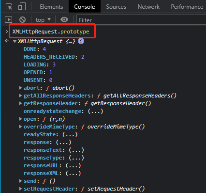
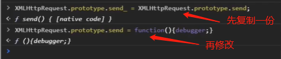
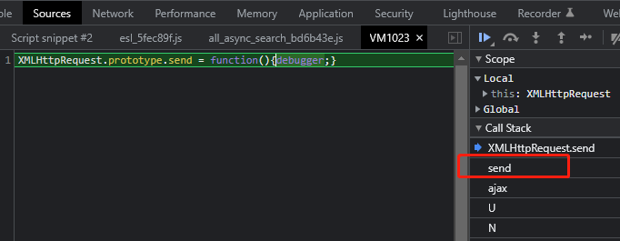
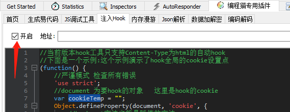
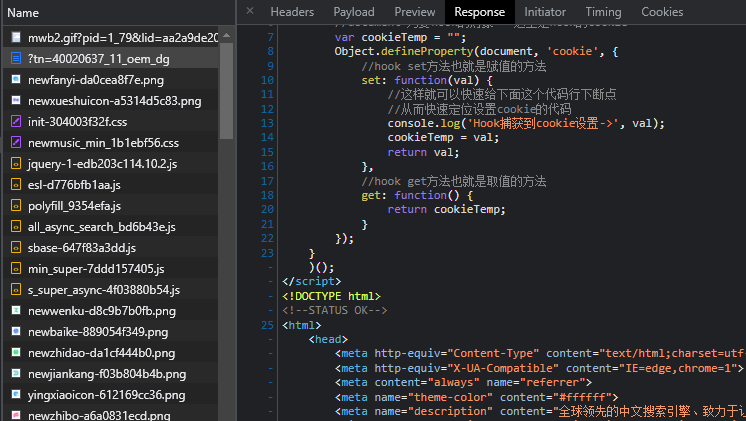
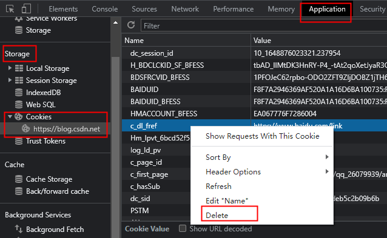

### 一、hook是什么？

浏览器交互流程：连接服务器——拿回资源——渲染（解析）资源

js执行流程：初始化（自执行）——页面逻辑——等待用户输入——加密数据——提交数据

hook就是在上面流程任意的环节，插入自己的代码，让浏览器先执行自己的代码，再执行原本的网站代码；hook只影响hook之后的操作。

### 二、如何hook

hook：改变原方法或原代码的执行流程（结合断点）

如何做？

#### 1、赋值给全局变量

- 将需要打印的值赋值给一个全局变量 `window.jieyang = xx_value`，如 ‘./js逆向.md’ 中的第五点

#### 2、覆盖原方法（覆盖的方法需要比原方法后执行）

- 1）直接将原方法等于某个值或另一个方法 `xxxfunc = function(){}`，如 ‘./js逆向.md’ 中的第八点的第2点

- 2）ES6语法：`Object.defineProperty`

  - 给对象重新定义属性
  - 监听属性的设置值和获取值

  ```js
  // hook全局的cookie设置点
  !(function(){
      // 严谨模式，检查所有错误
      'use strict';
      var cookieTemp = "";
      // document是要hook的对象；这里hook的是cookie
      Object.defineProperty(document, 'cookie', {
          // hook set方法，赋值的方法
          set: function(val){
              console.log('Hook捕获到cookie设置->', val);
              cookieTemp = val;
              return val;
          },
          // hook get方法，取值的方法
          get: function(){
              return cookieTemp;
          }       
      });
  })();
  ```


#### 3、js中的Proxy

- `const p = new Proxy(target, handler)`

#### 4、ajax请求hook

- ajax请求包含的方法在 `XMLHttpRequest` 对象下边

  

- hook方法：

  - 先在控制台执行以下内容（这里以发送数据为例）：

  

  - 然后再执行发送数据时（不是刷新网页），由于上面的代码，浏览器就会被debugger住；然后就能知道在哪里进行的 send ，如下图：

    

#### 5、刷新网页时hook

- 即我想在浏览器器初始化时就hook，那么就可以借助第三方插件了

  - 油猴（浏览器插件）

  - fiddler（代理）

    - 需要安装fiddler的[插件](https://blog.csdn.net/qq_36759224/article/details/120783727)，这里用到的是编程猫的插件（大佬写好的）

    - 插件安装好后，打开fiddler，编写hook代码，并开启hook，如下：

      

    - 然后浏览器打开某个网页（fiddler能抓包），会发现在网页源码开头会有我们的hook代码，那么这段代码就会先执行，再执行网页原代码，如下：

      

- 如果不想用第三方插件，可以在网页第一个请求的js中的第一行插入断点，然后刷新页面，被断住，然后在控制台执行hook代码，一样的效果。为什么是js？因为hook肯定是在js上啊

### 三、ast-hook 内存漫游（跟值）

【视频教程】https://www.bilibili.com/video/BV1Kh411r7uR?p=30&spm_id_from=pageDriver

【官网】https://github.com/CC11001100/ast-hook-for-js-RE

作用：之前我们跟加密参数，是搜索key值，而 ast-hook 可以跟（搜索） value 值。这个工具会将浏览器内存中的数据全部保存起来，方便检索，所以使用时在浏览器访问url有点慢。

原理：见官网

安装以及使用：

​	【fiddler中的编程猫专用插件中有一键开启内存漫游（有时需要管理员运行fiddler）（在任务管理器中，Fiddler下有Node.js才开启成功）（有些网站会失败，毕竟是别人写的插件）】

- 1）down下github上的 ast-hook 文件到本地
- 2）安装 node.js
- 3）安装依赖包：
  - 有两种安装：
    - 一种是安装到全局：`npm install -g anyproxy` （-g 全局安装）
    - 二种是安装到 ’D:\ast-hook-for-js-RE-master‘ 下：进入到此目录，执行 `npm install anyproxy`
  - anyproxy即代理，相当于是用node写的一个fiddler
  - 问题：
    - 第一种安装，会在第 `7）启动 proxy-server` 步启动报错：` Cannot find module 'anyproxy'`
    - 第二种安装，会在下一步 `启动 anyproxy` 时找不到 `anyproxy`  命令
    - 暂时的解决方法就是两种都安装
- 4）启动 anyproxy，
  - 重开cmd，输入：`anyproxy`  或者 `anyproxy ca` （带 ca 证书启动）
  - 可以看到有两个端口：8001 和 8002
- 5）浏览器输入 `127.0.0.1:8002` 进入管理UI面板，然后在 RootCA 中下载证书
  - 上面启动 anyproxy的窗口可以关闭了
- 6）双击证书，安装，安装到计算机（所有用户），安装到 ’受信任的根证书颁发机构‘
- 7）启动 proxy-server 
  - 在 ’D:\ast-hook-for-js-RE-master\src\proxy-server‘ 下，输入 `node proxy-server.js`
- 8）会在此目录下生成缓存文件 `js-file-cache`
  - 浏览器请求的js文件都会保存到这个文件中
  - 如果我们在浏览器中再次访问相同的url，发现不能访问了，可能是此url的作者更新了页面，我们需要清除此文件中的缓存文件
- 9）浏览器设置代理 127.0.0.1:10086
- 10）浏览器访问url，在有加密参数的地方，在控制台输入 `hook.search('value')` ，会输出所有涉及到变量改动的地方

​	

### 四、hook时的一些问题

#### 1、上下文

上下文：一个环境（js中：V8虚拟机；浏览器中：新页面），在 hook 时要注意上下文，

​	如下，我要 hook住 `ff()`方法，

​		在 `var ww = 2;` 处设置断点1，运行，在控制台处输出 `ff`，发现报错，原因是我们执行到断点处，已经出`zz()`方法了，已经是在全局作用域了，无 `ff()` 方法；

​		所以，要在断点2出设置断点。

```js
var qq = 1;
!(function zz(){
    var ff = function(){
        console.log('aaaaa');
    }
    debugger; //在此处设置断点2
})();
var ww = 2;  //在此处设置断点1
```

#### 2、打不上断点 + hook不住函数

在某些地方无法设置断点，可以在此处写一句代码 `debugger;` ，程序运行到此处会自动断掉。

​	看如下代码存在的问题：

```js
var qq = 1;
!(function zz(){
    function aa(){
        console.log('aaaaa');
    }
    //debugger;
    var bb = 3;
})();
var ww = 2;
```

​	上面代码在 `var bb = 3;` 处打断点时，打不上，此时要用 `debugger;`。

​	打上断点后，运行，此时已经在 `zz()`上下文中了，但是控制台输出 `aa` ，发现还是报错，此时需要使用 `var aa = function(){}` 来声明函数。

#### 3、hook未起作用（清缓存）

可能需要清一下缓存，特别是cookie。

方法：新开一个无痕窗口；或者 在控制台 Application 一栏中，清除（可只清除某一个参数），如下：


