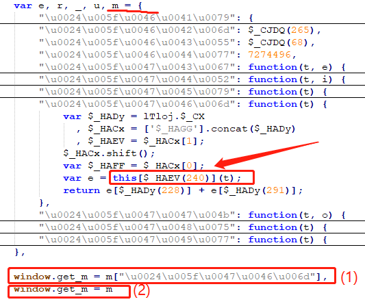

### 1、变量调用

```js
//在函数中调用 函数之后 声明的变量
function aa() {
	console.log(qqq);
	var c = 123;
}
var qqq = 222;
```

### 2、类型

在js中，`任何类型数据 + ""` 后均为字符串类型，如下图：


### 3、for ...... switch .......

​	【视频参考`34:00`左右】https://www.bilibili.com/video/BV1Kh411r7uR?p=18&spm_id_from=pageDriver

​	for循环 里加 switch  case 语句，称为平坦流（流程平坦化）

​	平坦流：不改变原代码的执行流程，但是改变了原代码的书写流程（可反爬）

​	反反爬措施：可以给每个case都下一个断点（知道进入哪一个case）（case比较多的话，就给switch下断点）

### 4、作用域

在方法中，若不声明变量，而是直接赋值，这种会直接设置为全局变量：

```js
function zz(){
    aa = 1;  //这是全局变量
    var bb = 2;  //这是局部变量
}
zz();
console.log(aa);  // 1，window.aa
console.log(bb); // 报错
```

### 5、this

`this` 同python中 `self`， 指向对象本身。

- 在全局作用域， `this` = `window`

  ```js
  function zz(){
     console.log(this);  // window对象
  }
  zz();  //这里是window调用的，winsow.zz()
  ```

  

- 在方法作用域，`this` = 调用者

- 类的方法里面，`this` = 类自己

  

在逆向中，如下图，对象的方法里有`this`关键字的，要将对象导出到全局（2），而不是导出对象中的属性（1），因为`this`指向的是对象（这里的this指向的是对象m） 



### 6、JSON.stringify()

`JSON.stringify()` 方法用于将 JavaScript 对象或值转换为 JSON 字符串；

`JSON.parse()` 方法用于将一个 JSON 字符串转换为 JavaScript 对象

```js
var aa = {1:'a'};
var bb = JSON.stringify(aa);
typeof(bb);  //字符串 '{"1":"a"}'
var cc = JSON.parse(bb);
typeof(cc); //对象 'object'
```

