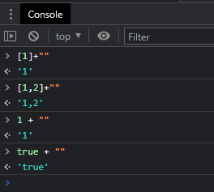

### 1、变量调用

```js
//在函数中调用 函数之后 声明的变量
function aa() {
	console.log(qqq);
	var c = 123;
}
var qqq = 222;
```

2、类型

在js中，`任何类型数据 + ""` 后均为字符串类型，如下图：



3、for ...... switch .......

【视频参考`34:00`左右】https://www.bilibili.com/video/BV1Kh411r7uR?p=18&spm_id_from=pageDriver

for循环 里加 switch  case 语句，称为平坦流（流程平坦化）

平坦流：不改变原代码的执行流程，但是改变了原代码的书写流程