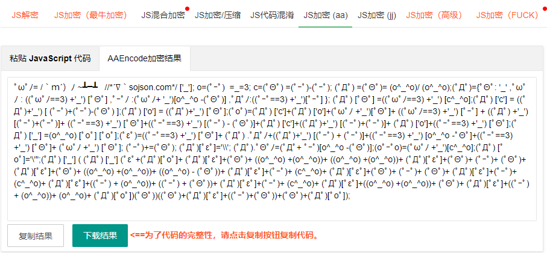
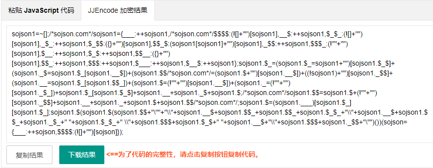

【参考】https://www.bilibili.com/video/BV1Kh411r7uR?p=14&spm_id_from=pageDriver

### 一、一些常见混淆

#### 1、eval混淆

​	1）混淆常量的名和值

​	2）混淆代码执行流程

​	`eval()`：可执行js代码（自带一个VM虚拟机），将js代码加密后放入其中，起到混淆作用，如下图：


#### 2、aa 与 jj 与 FUCK 加密混淆

一般是对js代码加密。

1）aa加密：JS默认支持Unicode，那么就支持全球所有的语言，那么就可以用其它语言的字符做变量，就会出现看着像 `O` 但不是 `o`，看着像 `0` 但不是 `0`，看着像 `p` 但不是 `p`

【在线js加密工具】https://www.sojson.com/aaencode.html

如下，将 `var a = 1;` 进行 aa 加密：



2）jj 加密：将 `var a = 1;` 进行 jj 加密：



3）FUCK加密：将 `var a = 1;` 进行 FUCK 加密：


#### 3、ob混淆

对变量和方法名进行替换，如下：

```js
var _0x30bb = ['log', 'Hello\x20World!'];  //变量数组

(function (_0x38d89d, _0x30bbb2) {
    var _0xae0a32 = function (_0x2e4e9d) {  //数组的以为操作
        while (--_0x2e4e9d) {
            _0x38d89d['push'](_0x38d89d['shift']());
        }
    };
    _0xae0a32(++_0x30bbb2);
}(_0x30bb, 0x153));

var _0xae0a = function (_0x38d89d, _0x30bbb2) {  //解密函数
    _0x38d89d = _0x38d89d - 0x0;
    var _0xae0a32 = _0x30bb[_0x38d89d];
    return _0xae0a32;
};

function hi() {  //加密后的函数
    console[_0xae0a('0x1')](_0xae0a('0x0'));
}

hi();
```

ob混淆的常见特性：

​		第一行可以看到明显的一个数组；

​		会有解密函数进行解密


之前这个网站有 ob混淆破解测试版：http://tool.yuanrenxue.com/，现在无了

### 二、AST 抽象语法树 + babel

【视频教程】https://www.bilibili.com/video/BV1Kh411r7uR?p=31&spm_id_from=pageDriver

作用：对js代码进行混淆

1、AST 抽象语法树

【参考】https://blog.csdn.net/huangpb123/article/details/84799198

简介：从纯文本转换成树形结构的数据，每个条目和树中的节点一一对应；当下的编译器都做了纯文本转AST的事情，

混淆过程：提交一段js代码 —> 混淆器（AST）—> 返回到网页。在文本转成AST后，对其进行一些增删改查操作，进行混淆。

2、babel

【官网】https://www.babeljs.cn/

【github使用手册】https://github.com/jamiebuilds/babel-handbook/blob/master/translations/zh-Hans/README.md

简介：Babel 是一个工具链，主要用于将采用 ECMAScript 2015+ 语法编写的代码转换为向后兼容的 JavaScript 语法，以便能够运行在当前和旧版本的浏览器或其他环境中（解决不兼容问题）。Babel 使用一个基于 [ESTree](https://github.com/estree/estree) 并修改过的 AST。

原理及使用：https://github.com/jamiebuilds/babel-handbook/blob/master/translations/zh-Hans/plugin-handbook.md

- 主要用到下面这些：

  

使用：我们做反混淆，只需要安装 babel-core

-  先在当前js文件目录下安装 babel-core：`npm install --save-dev @babel/core`

- 第一份简单示例（用的是pycharm）：

```js
const babel = require("@babel/core");
var code = "var a = 1"

const result = babel.transform(code);
console.log(result.code);
console.log(result)
```

- 第一份实例：
  - 【视频教程 `26:00` 左右】https://www.bilibili.com/video/BV1Kh411r7uR?p=32
  - 【参考案例】https://www.bilibili.com/video/BV1Kh411r7uR?p=32
  - 手动实现见 ‘./AST-babel/firstBabel.js’


