### 处理js逆向的一些思路

- 1、找参数加密规则
  - 1）直接搜关键字（参数名，特征值 (如setPublicKey) 等）
  - 2）搜索值（ast-hook 内存漫游）
  - 3）跟栈
  - 4）跟值（找到了加密规则，这时开始跟值理解代码）
  - 5）函数比较复杂的，混淆比较严重的，直接扣代码
    - 前提得是该代码能够执行，比如滑块验证码中拖动滑块后某个函数才会执行，那么这段代码单独抠出来，它是不会执行的


### 一、浏览器

​	先勾选下两项：


​	控制台打断点进入调试后，可选中代码，鼠标移上去可查看结果，如下图：

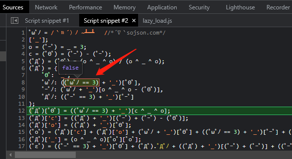

#### 1、浏览器重写Overrides

- 作用：可对变量、方法进行调试、打印输出
- 步骤：
  - 【参考】https://blog.csdn.net/qq_42961150/article/details/123499276
  - 【视频`27:00`左右】https://www.bilibili.com/video/BV1Kh411r7uR?p=36
  - 1）新建一个空白
  - 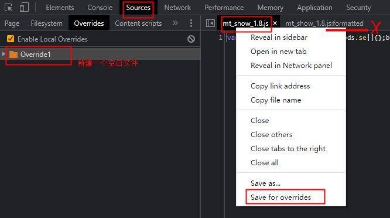
  - 2）右键未格式化的文件，Save for overrides，会看到文件名前多了一个圆点，此时可以对此文件重写
  - 3）添加一些调试语句后，保存
  - 4）刷新页面或者重新执行相应的ajax请求（提交表单），查看调试信息

### 二、浏览器断点

- 【参考】https://www.bilibili.com/video/BV1Kh411r7uR?p=8&spm_id_from=pageDriver

​	1）DOM断点：html源码设置断点，用于用户触发某个事件

​	2）xhr断点：断住向服务器发送了的包（断住指定的url）

​		【注意】：点击会触发断点（有时使用刷新页面不会触发，有时又会）

​		首先类型是xhr:	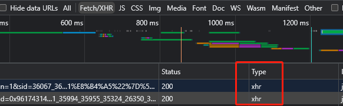

​		复制url上的关键的、不变的字段到 `XHR/fetch Breakpoints` 处，再次请求包含此字段的url就会被断住：

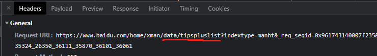

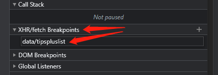	

​	3）自定义代码调式断点

​	4）代码中的断点：在源码中需要打断点的地方写入语句： `debugger;`

​	5）异常捕获断点：

​		a. 可以输出代码中 `try catch` 中的异常

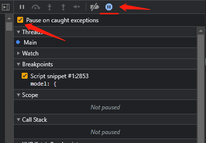

​		b. 可以跳过出现异常的语句（比如缺少某个模块环境）

​		首先将上图中的 `Pause on caught exceptions` 勾上；然后将报错的语句上打上断点；右键断点，如下图 —》编辑 —》输入`false` —》 回车；再刷新页面，可看到此语句不再报错     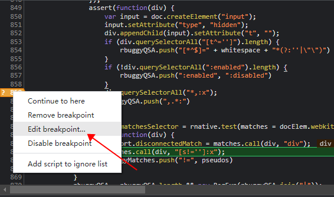	

6）全局事件断点

7）事件监听断点：在执行某个事件时给它断住

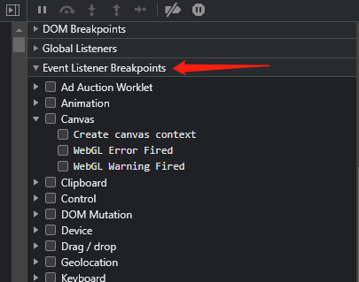


### 三、方法栈（跟栈）

栈，先调用的方法在下边，后调用的方法在上边

作用：对于一些加密参数，只有通过跟栈的方式去找到参数加密的位置，如教程：https://www.bilibili.com/video/BV1Kh411r7uR?p=19&spm_id_from=pageDriver

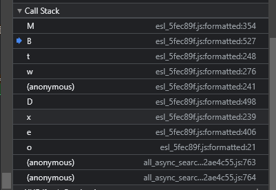

- 在跟栈过程中，遇到的一些问题及处理方式：
  - 1、遇到平坦流 for ... switch
    - 有多个case的且当前断点不是第一个case，可能前面的几个case都要加一个断点，因为不知道执行了哪些case
  - 2、某个代码块（for循环、函数等）（当前断点在此代码块中）没有对某变量进行修改，但此变量又有值，并且继续跟上一个栈，发现无此参数了
    - 那么说明此代码块对我们没作用了，可以过滤掉；在此代码块之前的（可能改变此变量的值的）语句打断点，刷新，执行到此处，再继续跟新的栈
- 在跟栈过程中，需要注意的关键字
  - `XMLHttpRequest`：收发数据包
  - XMLHttpRequest 中的`open()`：初始化一个请求
  - `then()`：（经验，大概率）：明文 => then => 密文。then 是 Promise 对象必须实现的一个方法。
    -  then()方法是异步执行。当 .then() 前的方法执行完后再执行 then() 内部的程序，这样就避免了数据没获取到等的问题；
    - `promise.then(onCompleted, onRejected)`
      - promise必需。Promise 对象实例。
      - onCompleted必需。成功完成时要运行的回调函数
      - onRejected可选。被拒绝（失败）时要运行的回调函数


### 四、加密方式

- 经常使用的加密算法: Base64、DES、3DES、RC4、AES，RSA等;
- 1）Base64加密
    - 特点：由 ‘A-Z、a-z、0-9、+、/、=’ 等组成；一般是 1 个或2个 '=' 结尾；是一种编码，可直接还原成明文
        - 例如: `bmV0ZHolNDBzaW5hLmNvbQ=`
- 2）对称加密：加密和解密的秘钥使用的是同一个（可带模值iv）
    - des，des3，aes
- 3）非对称加密：需要两个密钥：公钥和私钥
    - rsa
      - js中使用rsa加密的步骤（其中，只有`new`关键字不会变）：
        - new一个rsa对象
        - 设置公钥setPublicKey（在对象的属性中见到 `setPublic`（也会换成其他名字）,  意为设置公钥）
        - 加密encrypt
- 4）对称加密和非对称加密
    - 由 `ABCDEFGHIJKLMNOPQRSTUVWXYZabcdefghijklmnopqrstuvwxyz0123456789+/=`等组成（没有固定的长度）
    - 怎么与Base64加密区分：一般是先（非）对称加密，再 base64() 一下？
- 5）不可逆加密：
    - md5系列：md5、md2、md4、带密码的md5（hmac）
        - 特点：
            - md5长度：16位、32位、（40位？）。其中，同一个字串加密后的16位密文包含在32位密文中
            - 由 ‘0-9、a-f’或者字母大写 组成的16进制
        - 需要熟记 123456 的md5值（用作调试看是什么加密）（记开头几位就行）
            - 16位md5：`49ba59abbe56e057`
            - 32位md5：`e10adc3949ba59abbe56e057f20f883e`
        - 若大概率为md5加密：
            - 搜：`123456789`或者 `abcdef`（md5的默认key是 `0123456789abcdef`）
            - 搜：`1732584193` 或者 `271733879` 或者 `1732584197` 或者 `271733878` （md5有一些魔法值，没有实际意义，但删了又会报错）
    - SHA系列：sha1（40位）、sha256（64位）、sha512（128位）
        - 特点：
            - 由 ‘0-9、a-f’或者字母大写 组成的16进制
        - 需要熟记 123456 的sha值（用作调试看是什么加密）（记开头几位就行）
            - sha1（40位）：`7c4a8d09ca3762af61e59520943dc26494f8941b`
            - sha256（64位）：`8d969eef6ecad3c29a3a629280e686cf0c3f5d5a86aff3ca12020c923adc6c92`
            - sha512（128位）：`ba3253876aed6bc22d4a6ff53d8406c6ad864195ed144ab5c87621b6c233b548baeae6956df346ec8c17f5ea10f35ee3cbc514797ed7ddd3145464e2a0bab413`
- 6）加密模式:ECB、CBC、CFB、OFB等;
- 7）填充模式:NoPadding、PKCS1Padding、PKCS5Padding、PKCS7Padding

遇到加密算法，有两个思路：1）扣出加密函数，直接运行；2）找明文、找密钥，再手动实现

### 五、如何js逆向（一些调试经验）

- 【参考】https://www.bilibili.com/video/BV1Kh411r7uR?p=11&spm_id_from=pageDriver
- 搜关键字：
    - 参数名、挨着此参数的其他参数（相邻参数在源码中可能不会相隔太远）
    - 加密方法名
    - 若大概率为md5加密：
      - 搜：`123456789`或者 `abcdef`（md5的默认key是 `0123456789abcdef`）
      - 搜：`1732584193` 或者 `271733879` 或者 `1732584197` 或者 `271733878` （md5有一些魔法值，没有实际意义，但删了又会报错）
- 扣出关键js代码运行
    - 扣出的js代码改动越少越好
      - 前提得是该代码能够执行，比如滑块验证码中拖动滑块后某个函数才会执行，那么这段代码单独抠出来，它是不会执行的
- 如下图：（闭包问题）遇到连续定义并用多个逗号分开的，又想要调用变量以及变量中的方法，可做如下修改：
    - 将某个语句前的逗号改为var声明
    - 加入全局变量： `window.zhiyuan = utils;`
    - 那么在运行代码后，可直接调用全局变量
    - 为什么要这样做：因为有些闭包，外部无法访问内部的变量（让局部变全局，方便调试）
    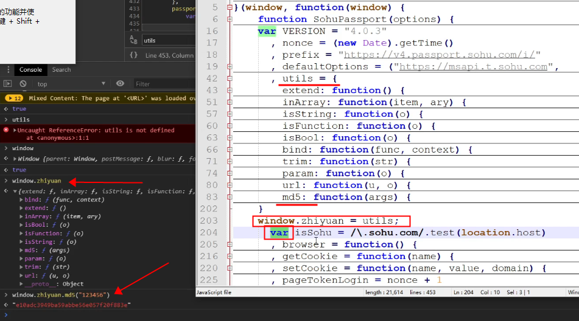

### 六、伪造浏览器环境

【参考】https://www.bilibili.com/video/BV1Kh411r7uR?p=16&spm_id_from=pageDriver	

#### 1、浏览器简介（DOM、BOM与 JS引擎 的关系）

​	1）浏览器组成：一个浏览器包含DOM、BOM、JS引擎。

- DOM：文档对象，允许程序和脚本动态地访问、更新文档的内容、结构和样式

- BOM：（Broswer Object Model）浏览器自己实现的一些类：window、location、navigator、history等，用来进行与浏览器相关的一些操作。
  - window：一般用于调用Global对象
  - location：提供了与当前窗口中加载的文档有关的信息
  - navigator：主要用来获取浏览器的属性，区分浏览器类型
  - history：history 对象保存着用户上网的历史记录
- JS引擎：即js的解释器，有谷歌v8、微软查克拉、quickjs

​	2）关系

​		DOM、BOM都是js对象；

​		所有js引擎都有一个功能：可以给js 添加/删除 任意对象，或者关联本地代码

​	3）es5 与 es6：形成JS基础的标准化脚本语言

​		【官网】https://developer.mozilla.org/zh-CN/docs/Web/JavaScript

​	另外，浏览器一般都实现了常见的加密算法：如btoa、AES、DES、MD5等。

#### 2、构造浏览器环境

1）为什么要构造：

​	浏览能执行js代码是因为有js引擎，但是在其它地方（比如fiddler）没有引擎；

​	浏览器实现的对象（比如document）是只读属性，在其它地方没有这些对象（如`document.getElementsByTagName('h1')`），无法执行;

​	网站太复杂，扣不出js代码，通过伪造浏览器环境来解决。

2）怎么伪造：

​	全部伪造：window、location、navigator、history等。如Python中的jsdom、nodejs，但与真正的浏览器肯定有不同的地方，就会被检测出来；

​	给指定的网站伪造：如何知道网站检测了什么（执行js需要哪些环境模块）？通过调试、异常捕获、本地环境运行看报错。

### 七、浏览器反调试（hook）

【参考】https://www.bilibili.com/video/BV1Kh411r7uR?p=17&spm_id_from=pageDriver

反调试：阻挠你进行调试

#### 1、检测是否在调试的方式

- 键盘监听（按下F12）

- 检测浏览器内外高度的差值（浏览器打开调试工具会减小内高）

- 检测开发者工具变量是否为true

- 检测 `console.log()` 调用的次数

- 利用代码执行的时间差（调试会打断点，那么断点之后的代码会在我们点击单步调试后才会运行，会隔一段时间）

- 检测栈的层数 `func_name.caller`：可以检测是谁调用的我

- 利用`tostring` 检测行为，然后将你引向错误的逻辑。如下图，在调试时，将鼠标放到方法上，就调用了tostring

  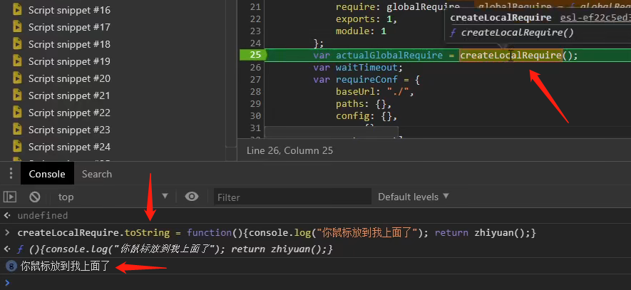

#### 2、反调试手段

- ##### 1）debugger

  - 原代码会调用 debugger语句，应对方法：

  - 虚拟机（debugger在虚拟机文件中）

    - 因为是在虚拟机中，所以源码中会调用`eval()`或者`Function`（构造函数constructor）

    - `Function` 的处理一般是让其等于一个空函数，让其不执行，如下图（具体做法见参考链接 `0:35:00` 左右）【属于hook内容】

      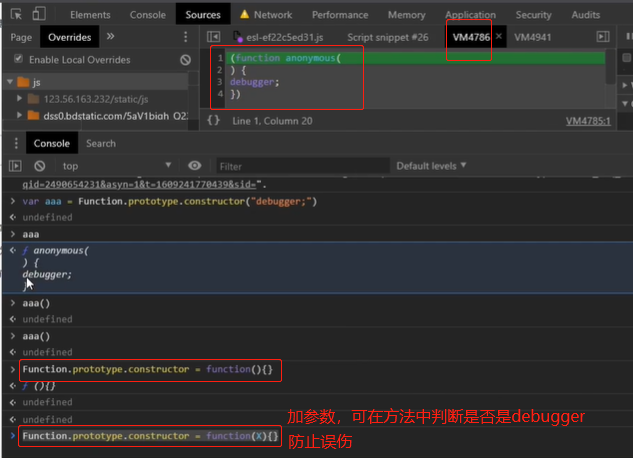

      加参数判断语句：

      ```js
      var aaa = Function.prototype.constructor;
      Function.prototype.constructor = function(x){
          if(x!='debugger'){
             	//为什么要这样返回
              //因为源码一般为 Function.prototype.constructor('debugger')
              //所以要根据源码来写
              return aaa(x);
          }
          return function(){}; //要返回一个函数
      }
      ```

      

    - 此方法可以让某个方法不执行（例如不执行 ‘让你进入debugger’ 的方法），见下图：

      - setInterval()：定时器

      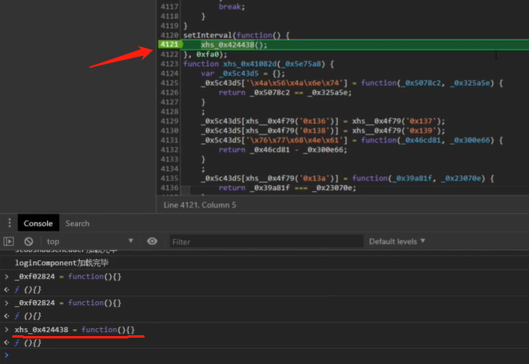

    - `eval()` 同理

    - 上述hook方式的缺点：每次翻页什么的都要在控制台执行hook代码，解决方法是，使用fiddler中的hook

  - 非虚拟机：

    - 将 `debugger` 那句代码加断点，然后编辑其值为`false`（参考第二点 ‘浏览器断点’ ），不执行此句代码。
    - 直接替换代码：
      - 使用fiddler代理替换代码，具体做法见参考链接 `0:30:00` 左右

- ##### 2）死循环（卡死）

  - 按F12后调用死循环。如循环语句、无限递归、两个方法互调、定时器、打开新页面、写你的历史记录

- ##### 3）引向错误的逻辑
  
  - 解决方法：可以hook住堆栈，然后进入浏览器F12查看堆栈，进行对比
  
- ##### 4）检测代码是否经过了格式化

  - 如：使用正则检测
  - 解决方法：打断点，单步调试，找到检测的位置，并修改代码（代码较短，就可以不格式化） 

#### 3、网站不能进入开发者模式

- 1）使用fiddler，注入hook进行尝试

  - 先用简单的hook进行尝试

    - 分析：若是网站不让你进入开发者模式，可能是用了定时器一直在检测，定时器hook代码：

    - ```js
      window.setInterval_ = setInterval;
      setInterval = function(x, x1){
          debugger;
          return window.setInterval_(x, x1);
      }
      ```

- 2）分析fiddler抓到的包

#### 4、实例

- 1）网站：https://bqcm0.cavip1.com/，打开浏览器抓包，发现请求的url的源码为空（加 XHR 断点）。解决方法是：打开fiddler代理就可以了（因为 fd 有缓存），此时可以正常下断点操作了。比如这个网站：https://bqcm0.cavip1.com/

  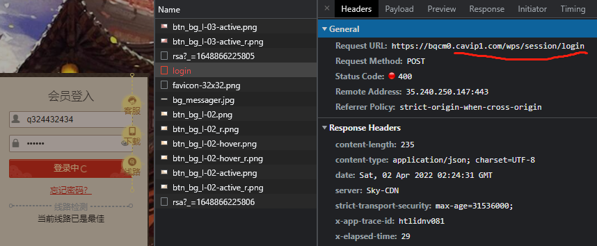

  - 上图中，我们需要 login 的一些动作，就设置了 XHR 断点，然后重新登陆，被断住，如下图：

    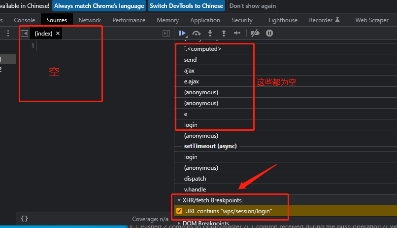

### 八、woker多线程调试

【参考】https://www.ruanyifeng.com/blog/2018/07/web-worker.html

【视频教程】https://www.bilibili.com/video/BV1Kh411r7uR?p=34

简介：Worker 线程用于执行计算密集型或高延迟的任务，使得主线程（通常负责 UI 交互，DOM对象）就会很流畅，一个V8引擎就是一个线程。

特点：

- Worker 线程和主线程不在同一个上下文环境，它们不能直接通信，必须通过消息完成
- 一般是在子线程中加密，然后返回给主线程

原理：

- 主线程创建Worker线程

  - `var worker = new Worker('work.js');`

- 主线程向Worker发消息

  - `worker.postMessage('Hello World');`

- 主线程指定监听函数，接收子线程发回来的消息

  - `worker.onmessage = function (event) {console.log('Received message ' + event.data);}`

- 主线程关掉Worker

  - `worker.terminate();`

- Worker线程接收消息与发消息

  - ```js
    // self代表子线程自身，即子线程的全局对象（类似于window对象）
    self.addEventListener('message', function (e) {
      self.postMessage('You said: ' + e.data);
    }, false);
    
    self.close(); // Worker 线程关闭
    ```

调试：

​	经过上面原理可知，浏览器在使用Worker多线程时，会有固定的一些关键字，可直接搜索下面的关键字，得到发送数据的位置：

​		主线程：`Worker`，`postMessage`，`onmessage`等

​		Worker线程：`self`，`addEventListener`，`postMessage`，`onmessage`等

### 九、调试技巧（一些调试经验）

1、下断点的位置（多个）：初始值的位置、赋值的位置、循环的位置、返回的位置、函数的开头与结尾

2、在对象的属性中见到 `setPublic`（也会换成其他名字）,  意为设置公钥，那么有公钥的，大概率是 RSA 加密

- js中使用rsa加密的步骤（其中，只有`new`关键字不会变）：

  - new一个rsa对象

  - 设置公钥setPublicKey

  - 加密encrypt

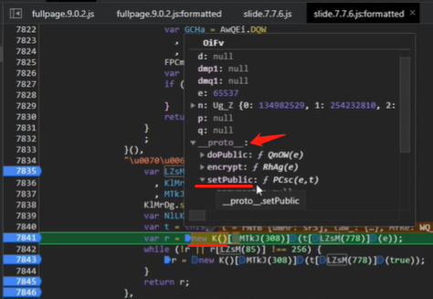

3、对于某一句代码，想看它每次执行的结果是否一致，可将其复制到控制台输出

4、遇到加密算法，有两个思路：1）扣出加密函数，直接运行；2）找明文、找密钥，再手动实现

5、在某些地方无法设置断点，可以在此处写一句代码 `debugger;` ，程序运行到此处会自动断掉

6、加密参数有时效性，在调试过程中，可能找不到某个加密参数，那么可能是失效了，需要重新刷新页面

7、在调试时，对于鼠标移上去弹出的函数，点不进去，可以在控制台输出后，再点击进去

8、某句代码看不懂，可以输出到控制台，根据输出值来判断其作用

9、函数比较复杂的，混淆比较严重的，直接扣代码
​	（前提得是该代码能够执行，比如滑块验证码中拖动滑块后某个函数才会执行，那么这段代码单独抠出来，它是不会执行的）

10、在逆向中，`this`关键字的处理方式：见 `./js基础.md`

11、在js中可能会调用某些库（如加密库CryptoJS），我们在逆向的时候最好不要调库，可以将库中用到的方法抠出来

- 抠加密库CryptoJS的代码：见 【视频 `0:13:00`】https://www.bilibili.com/video/BV1Kh411r7uR?p=28

12、在本地调试时，报错无`window`，可添加一句代码：`var window = this;`或者`var window = global;`

13、下面这种就是加密后的值，是字节集的形式，数组中每一个元素占4个字节，共32个字节，即密文长度是32

​				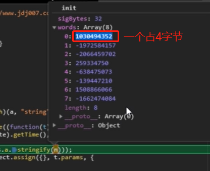

14、网页返回 503 状态码，在浏览器中是没有数据的（因为浏览器看到是503就会自动清缓存），这时可以用抓包工具


### 十、跟值技巧

​	跟值：找到了加密规则，这时开始跟值理解代码

- 从头看：
  - 优点：不需要重复下断点
  - 缺点：要记住很多的变量值
- 从尾看：
  - 优点：更轻松，只需关注与返回变量相关的语句（逆向思维）（相关的语句都可下断点）
  - 缺点：可能会有重复下断点的操作（因为尾部的操作可能已经改变了之前的变量的值，需要给之前的语句下断点查看未改变之前的值）

在实际操作中，灵活运用，可在开头和结尾都加断点等

下断点的位置（多个）：初始值的位置、赋值的位置、循环的位置、返回的位置、函数的开头与结尾


### 十一、环境检测

- 1、window全局变量：
  - location
    - host
    - href
- 2、html渲染环境
  - document事件
  - 检测是否是浏览器环境
  - 浏览器指纹（当网页已加载），可检测你是不是同一个用户（防止你大量请求）
- 3、插件环境
  - 在浏览器的控制台中输入`navigator.plugins`，可查看已加载的插件，可能就会检查是否有这些插件

### 十二、本地联调（动态JS文件）

本地联调主要是处理网站中的动态JS文件（**url后面是时间戳**），使用 Fiddler 中的 AutoResponder 工具来解决。

AutoResponder 的作用：根据设置的规则，匹配url，拦截符合规则的url包，将其替换为本地文件，并发给浏览器；那么可以将网站中的动态js文件代码，替换为我们本地的js代码。就可以在我们本地的代码中写上`debugger;`，或者其他操作。

实例：`crawler_learn\actual_combat\破解登录case2`

### 十三、抠代码

两种代码风格：

1、webpack模块化：形如下面代码

```js
function(x){
    function xx(yy){
        x[yy].call(xx1, xx2, xx3);  // 这里必有一个调用模块的方法
    }
    xx(0);
}([  // 数组(or对象)
    function(x1,x2,x3){}, 
    function(){}  //一个一个的模块 
])
```

- 怎么抠：
  - 1）找到这个调用模块的方法，保留此方法所在的函数`xx()`
  
  - 2）找到调用的模块
  
  - 3）构造一个自执行方法（注意修改其中的参数）
    - **【注意】将自执行方法的参数改为放在一个对象中，因为方法中会使用到this关键字**
    
    ```js
    function(x){
        function xx(yy){
            x[yy].call(xx1, xx2, xx3);  // 这里必有一个调用模块的方法
        }
        xx(0);
    }({  // 对象
        aa1: function(x1,x2,x3){}, 
        aa2: function(){}  //一个一个的模块 
    })
    ```
    
    
  
- 实例：`crawler_learn\actual_combat\破解登录case3`

2、普通的

```js
function(){};
function(){}  // 一个挨着一个的
```


执行抠出的代码会报错缺少某某东西，有以下的解决方法：

- 1）缺啥补啥（要看什么类型）

  - 示例：【参考视频教程 `00:55:00`】阿里云盘：志远 > 一期 > 8.2.1 不带k值5秒防护

    ```js
    // 缺啥补啥
    // 主要是注意类型
    var document = {
        createElement: function (x) {
            if(x == 'div'){
                return {
                    innerText: "",  // 因为原码中有赋值，所以这里可以置为空
                    firstChild: {
                        href: "xxx" // 下面的代码中浏览器控制台执行，查看结果xxx
                    }
                }
            }
            return {};
        }
    }
    
    // 原码
    !function(){
        var t = document.createElement('div')  // createElement：是一个方法；t：可打印查看，是一个对象
        t.innerText = "<a href='/'>x</a>"   // innerText:对象的属性
        t = t.firstChild.href  // 浏览器控制台执行，查看结果
    }()
    ```

    

- 2）若报错的地方是一些环境判断等无关紧要的，可以直接删除掉
