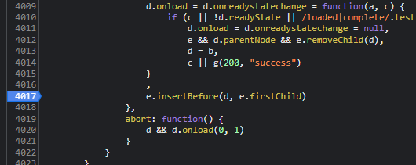
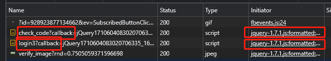
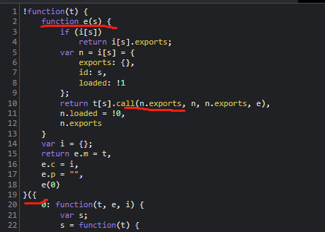
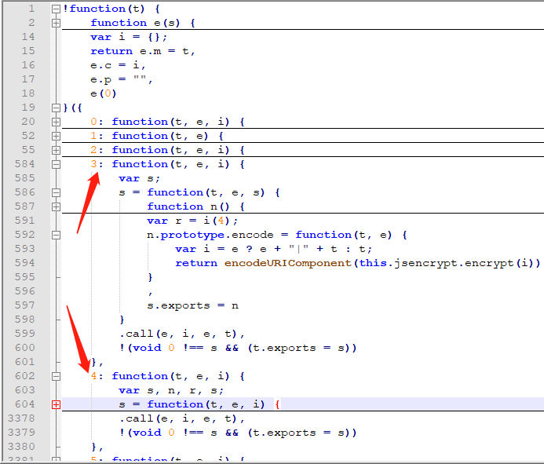
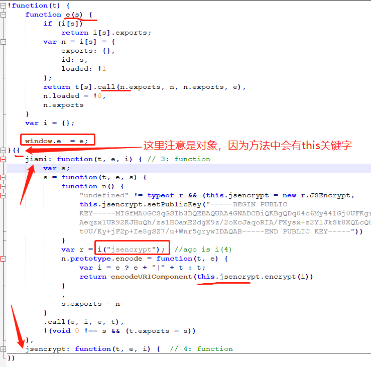
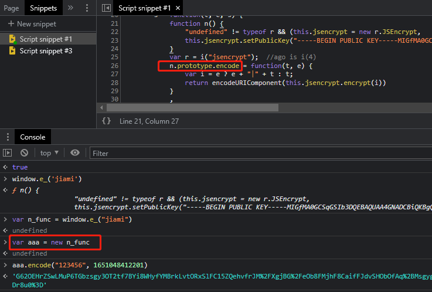

【视频教程】阿里云盘：志远 > 一期 > 7.5.2 常见加密算法_webpack

【网站】https://www.gm99.com/

### 爬取步骤

### 1、定位

​	如下图，打上断点

​			

​	继续跟值，会发现找不到加密参数，这是因为会先检查验证码，它也会调用这些代码，可在 Network 下面看到，如下图：

​			

​	所以第一次执行到断点处是在检查验证码，第二次执行到断点处才是send `password`。

​	继续跟栈，定位如下的位置：

​			

【**继续跟栈，发现都是在这个文件中，那么只需要关注这个文件。可以抠代码了，然后看文件开头的代码，属于是模块化代码**】

### 2、抠模块化代码

源码是这样的：

​				

模块化代码：对于形如下面代码的，我们称为模块化代码

```js
function(x){
    function xx(yy){
        x[yy].call(xx1, xx2, xx3);  // 这里必有一个调用模块的方法
    }
    xx(0);
}([  // 数组(or对象)
    function(x1,x2,x3){}, 
    function(){}  //一个一个的模块 
])
```

怎么抠：

- 1）找到这个调用模块的方法，保留此方法所在的函数`xx()`，删除其他不相关的代码

  ```js
  !function(t) {
      function e(s) {
          if (i[s])
              return i[s].exports;
          var n = i[s] = {
              exports: {},
              id: s,
              loaded: !1
          };
          return t[s].call(n.exports, n, n.exports, e),
          n.loaded = !0,
          n.exports
      }
      var i = {};
  }()
  ```

- 2）找到调用的模块

  - 经过跟栈，找到调用了3、4两个模块

    

- 3）构造一个自执行方法

​	将上面两步的代码结合，并修改某些参数，并导出到全局变量，如下：

​			

​	`jiami`的方法中的参数`i`是谁？

​			可以断点，查看；

​			可以分析：因为是上面 `call()` 调用的，call 里面有4个参数，前三个都是对象，只有 e 是方法；再看 `i` ，是作为方法在使用，所以`i`是`e`。

​	**【注意】参数是在一个对象中，因为方法中会使用到this关键字**

- 4）调用，进行加密。

  ​	源码中，是给 `n()` 的原型添加了一个方法 `encode`，`n()`的实例会继承此方法，所以需要 new 一个实例，再调用 encode 方法进行加密，如下： 

  