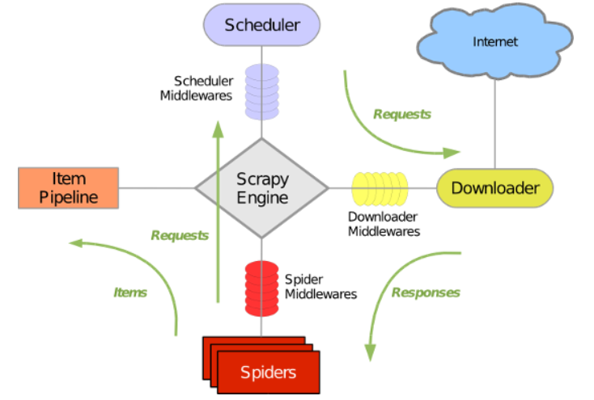

- 目录
    - 1、使用流程
    - scrapy优缺点
    - scrapy去重原理
    - 2、日志log
    - 3、持久化存储
    - 4、scrapy五大核心组件简介
    - 5、请求传参（在持久化存储时在爬虫文件中的不同方法中传递item对象）
    - 6、图片数据爬取之ImagesPipeline
    - 7、scrapy中间件（设置请求代理）（selenium）
    - 8、基于CrawlSpider的全站数据爬取
    - 9、分布式爬虫 (redis)
    - 10、增量式爬虫 (redis)
    - 11、scrapy提高爬取速度
    - 12、请求返回的数据（response）的解析
    - 13、scrapy调试（执行）
    - 14、面试


### 1、使用流程
- 1、创建工程：
    - 进入到某路径下执行`scrapy startproject ProName`
- 2、进入工程目录：
    - `cd ProName`
- 3、创建爬虫文件：
    - `scrapy genspider spiderName www.xxx.com`
- 【设置setting.py】
    - `ROBOTSTXT_OBEY = False`
        - 先更改为不遵守
    - 日志log
    - 设置请求头
- 4、 编写相关操作代码
- 【5、可选：持久化存储】
- 6、 执行工程：
    - `scrapy crawl spiderName [--nolog]`
    - 另一种执行方式：目录中的第13点
    
### scrapy优缺点
- 优点
    - 1）scrapy 是异步的，可以灵活调节并发量
    - 2）采取可读性更强的 xpath 代替正则，速度快
    - 3）写 middleware,方便写一些统一的过滤器
    - 4）同时在不同的 url 上爬行
    - 5）支持 shell 方式，方便独立调试
    - 6）通过管道的方式存入数据库，灵活，可保存为多种形式
    - 它更容易构建大规模的抓取项目
    - 它异步处理请求，速度非常快
    - 它可以很方便的调整爬取速度
    - 可以实现高并发的爬取数据, 注意使用代理;
    - 提供了一个爬虫任务管理界面, 可以实现爬虫的停止,启动,调试,支持定时爬取任务;
    
- 缺点：
    - 1）无法用它完成分布式爬取
    - 2）自身去重效果差，消耗内存，且不能持久化【Scrapy中用集合set()实现这个request去重功能】
    - 3）对于需要执行js才能获取数据的网页，爱莫能助 
    - 4）兼容了下载图片与视频，但是可用性比较差
    - 5）自身扩展的log模块，不好用，经常需要自定义
    - 6）基于 twisted 框架，运行中的 exception 是不会干掉 reactor（反应器），并且异步框架出错后是不会停掉其他任务的，
         数据出错后难以察觉，预警系统简单的使用邮件，很不友好

### scrapy去重原理
- 需要将dont_filter设置为False开启去重，默认是False
    - `scrapy.Request(url, dont_filter=False)`, 如项目./get_update_data
- 对于每一个url的请求，调度器都会根据请求的相关信息加密得到一个指纹信息，并且将指纹信息和set()集合中得指纹信息进行比对，
  如果set()集合中已经存在这个数据，就不在将这个Request放入队列中。如果set()集合中没有，就将这个Request对象放入队列中，等待被调度。

### 2、日志log
- 控制输出信息
  - 在执行工程时会输出log信息，可加--nolog让其不输出（不推荐，因为看不到错误信息）
  - 可在settings.py文件中添加属性 `LOG_LEVEL = 'ERROR'` 来实现 （推荐）
    - Scrapy提供5层logging级别:  
        CRITICAL - 严重错误(critical)  
        ERROR - 一般错误(regular errors)  
        WARNING - 警告信息(warning messages)  
        INFO - 一般信息(informational messages)  
        DEBUG - 调试信息(debugging messages)
      
### 3、持久化存储
- 【代码在 learn_scrapy 中】
- 3.1 基于终端指令的持久化存储
    - 要求：只可以将parse方法的可迭代类型对象（通常为列表or字典）返回值写入本地的文本文件中
    - 执行终端指令：
        - scrapy crawl 爬虫名称 -o xxx.json
        - scrapy crawl 爬虫名称 -o xxx.xml
        - scrapy crawl 爬虫名称 -o xxx.csv
- 3.2 基于管道的持久化存储
    - 认识两个文件
        - items.py：数据结构模板文件。定义数据属性。
        - pipelines.py：管道文件。接收数据（items），进行持久化操作
    - 持久化流程  
        - 1、爬虫文件爬取到数据后，需要将数据封装到items对象中。  
            - items.py中添加：  
                ```
                author = scrapy.Field()
                content = scrapy.Field()
                ```  
            - 爬虫文件first.py中封装：  
                ```
                from learn_scrapy.items import LearnScrapyItem
                item = LearnScrapyItem()
                item['author'] = author
                item['content'] = content
                ```  
        - 2、使用yield关键字将items对象提交给pipelines管道进行持久化操作。  
            - 爬虫文件中：`yield item`  
        - 3、在管道文件中的 process_item() 方法中接收爬虫文件提交过来的item对象，然后编写持久化存储的代码将item对象中存储的数据进行持久化存储  
        - 4、settings.py配置文件中开启管道
            ```python
            - ITEM_PIPELINES = {
                    # 300表示的是优先级，数值越小优先级越高
                   'learn_scrapy.pipelines.LearnScrapyPipeline': 300,
                }
            ```
    
    - 【问题】如果最终需要将爬取到的数据值一份存储到磁盘文件，一份存储到数据库中，则应该如何操作scrapy？
        - 【答】可以再定制一个管道类：  
            ```python
            class LearnScrapyItem_db:
              def process_item(self, item, spider):
                  #持久化操作代码 （方式1：写入数据库）
                  return item
            ```  
          在settings.py开启管道操作代码为；  
            ```python
            ITEM_PIPELINES = {
                'doublekill.pipelines.DoublekillPipeline': 200,
                'doublekill.pipelines.DoublekillPipeline_db': 300,
            }
            上面字典中的键值表示的是即将被启用执行的管道文件和其执行的优先级(值越小越先执行)
            ```
          
    - 【问题】有多个管道类，那么 yield item 先提交给哪个管道类呢？后续的管道类怎么接收这个item呢？
        - 【答】会先提交给优先级最高的管道类
            ```python
            def process_item(self, item, spider):
                  #持久化操作代码 （方式1：写入数据库）
                  return item
            # 【return item 会将item传递给下一个即将被执行的管道类】
            ```
- 3.3 管道类初始化传参（from_crawler类方法）
    - 可以在初始化的时候传递参数
```python
import pymongo
class KuanPipeline(object):

    def __init__(self, mongo_url, mongo_db):  # 可以传参，参数来自下面的类方法中
        self.mongo_url = mongo_url
        self.mongo_db = mongo_db

    # from_crawler 是一个类方法，在初始化的时候，从 setting.py 中读取配置
    @classmethod
    def from_crawler(cls, crawler):
        return cls(     # cls代表的是类的本身，相对应的self则是类的一个实例对象
            # 获取当前爬虫项目下的setting.py文件中的参数
            mongo_url=crawler.settings.get("MONGO_URL"), 
            mongo_db=crawler.settings.get("MONGO_DB")
        )
```


          
### 4、scrapy五大核心组件简介

- 1引擎(Scrapy)
    - 用来处理整个系统的数据流, 触发事务(框架核心)
- 2调度器(Scheduler)
    - 用来接受引擎发过来的请求, 将Request对象压入队列（Queue）中, 并在引擎再次请求的时候返回. 可以想像成一个URL（抓取网页的网址或者说是链接）的优先队列, 由它来决定下一个要抓取的网址是什么, 
    - 同时去除重复的网址
    - scrapy中有一个本地爬取队列Queue，这个队列是利用deque模块实现的，如果有新的请求发起之后，就会放到队列里面，然后该请求会被scheduler调度，之后该请求就会交给Downloader执行爬取。
    - 调度器的队列中应该存放的是Request对象（包含url，callback函数、headers等信息）
- 3下载器(Downloader)
    - 用于下载网页内容, 并将网页内容返回给蜘蛛Spiders (Scrapy下载器是建立在twisted这个高效的异步模型上的)
- 4爬虫(Spiders)
    - 爬虫是主要干活的, 用于从特定的网页中提取自己需要的信息, 即所谓的实体(Item)。用户也可以从中提取出链接,让Scrapy继续抓取下一个页面
- 5项目管道(Pipeline)
    - 负责处理爬虫从网页中抽取的实体，主要的功能是持久化实体、验证实体的有效性、清除不需要的信息。当页面被爬虫解析后，将被发送到项目管道，并经过几个特定的次序处理数据。
- 中间件
    - 下载器中间件、爬虫中间件、调度器中间件。主要使用下载器中间件，用于拦截请求与响应，设置代理等
- 流程
    - 1）引擎打开一个域名，蜘蛛处理这个域名，并让蜘蛛获取第一个爬取的URL。
    - 2）引擎从蜘蛛那获取第一个需要爬取的URL，然后作为请求在调度器中进行调度。
    - 3）引擎从调度那获取接下来进行爬取的页面。
    - 4）调度将下一个爬取的URL返回给引擎，引擎将他们通过下载中间件发送到下载器。
    - 5）当网页被下载器下载完成以后，响应内容通过下载中间件被发送到引擎。
        - （如果失败：不好意思，这个request下载失败，然后引擎告诉调度器，这个request下载失败了，你记录一下，我们待会儿再下载。）
    - 6）引擎收到下载器的响应并将它通过蜘蛛中间件发送到蜘蛛进行处理。
    - 7）蜘蛛处理响应并返回爬取到的item，然后将item以及新的请求对象返回给引擎。
    - 8）引擎将抓取到的item提交给管道，并将新的请求对象发送给调度器。
    - 9）系统重复第3步操作，直到调度中没有请求，然后断开引擎与域名之间的联系
        - （对于下载失败的url，Scrapy会重新下载。）

### 5、请求传参（在持久化存储时在不同方法中传递item对象）
- 【all_page_crawl文件中的示例】
- 使用场景：列表列和详情页均有需要解析的数据（一条数据的各项不在同一个页面中），且不在同一个方法中，在持久化存储时不能提交多次item，所以用到meta属性来传递上一个方法的item对象给下一个方法
- 【问题】为什么不用全局变量呢？这样就可以不用传参了啊
    - 【答】可能这里是为了演示有这个功能吧
    

### 6、图片数据爬取之ImagesPipeline
- ImagesPipeline使用流程
    - 在爬虫文件中获取图片的src，并提交item给管道类【同上面持久化存储的提交】
    - 在配置文件中进行如下配置：
        - IMAGES_STORE = './imgs'  表示最终图片存储的目录  
    - 在管道类中继承ImagesPipeline父类，并重写父类方法
        ```python
        from scrapy.pipelines.images import ImagesPipeline
        #ImagesPipeline专门用于文件下载的管道类，下载过程支持异步和多线程
        class ImgPipeLine(ImagesPipeline):
          #对item中的图片进行请求操作
          def get_media_requests(self, item, info):
              yield scrapy.Request(item['src'])
          #定制图片的名称
          def file_path(self, request, response=None, info=None):
              url = request.url
              file_name = url.split('/')[-1]
              return file_name
          def item_completed(self, results, item, info):
              return item  #该返回值会传递给下一个即将被执行的管道类
        ```         
      
### 7、scrapy中间件
- 下载中间件（Downloader Middlewares）【selenium的使用】
    - 位置：位于scrapy引擎和下载器之间的一层组件。
    - 作用：我们主要使用下载中间件处理请求，一般会对请求设置随机的User-Agent ，设置随机的代理。目的在于防止爬取网站的反爬虫策略。
        - （1）引擎将请求传递给下载器过程中， 下载中间件可以对请求进行一系列处理。比如设置请求的 User-Agent，设置代理等
        - （2）在下载器完成将Response传递给引擎中，下载中间件可以对响应进行一系列处理。比如进行gzip解压等。
        - 单个代理可以直接在配置文件中设置，多个代理、代理列表则需要用到中间件 
    - 1、'拦截请求'的使用步骤（crawl_wangyi_news项目文件下）：
        - 在middlewares.py文件中，配置ScrapyLearnDownloaderMiddleware类
            - 在process_request(),process_exception()方法中设置UA、代理
        - 在配置文件中开启下载中间件
            - DOWNLOADER_MIDDLEWARES = {
                   'scrapy_learn.middlewares.ScrapyLearnDownloaderMiddleware': 543,
                }
              
    - 【**完整项目01**】爬取网易新闻数据【包含多板块多url、传参item对象、selenium的使用、动态数据、中间件】
        - 此项目有动态数据，这里用到’下载中间件‘拦截响应对象，并使用selenium重新请求动态数据
        - 遇到动态数据selenium，也可以不使用中间件，可以在spider文件中重写 start_requests() 方法
    - 2、'拦截响应'的使用步骤（crawl_wangyi_news项目文件下）【selenium的使用】
        - 在middlewares.py文件中，配置ScrapyLearnDownloaderMiddleware类
            - 在process_response()方法中设置拦截响应数据后的处理
            - 在配置文件中开启下载中间件、开启管道
        - 在spider777爬虫文件下编写爬虫程序
- 当然，也可以在中间件中自定一个 中间件类，在此类中实现相应的方法就行，然后在配置文件中开启此管道【例如100例中的'3scrapy-32-B站博人传评论数据'】
    
### 8、基于CrawlSpider的全站数据爬取
- 【代码在 crawlSpider_learn 文件中】
- CrawlSpider类：Spider的一个子类
- 全站数据爬取的方式：
    - 基于Spider父类：手动请求（编写request代码）
    - 基于CrawlSpider父类
- CrawlSpider类的使用：
    - 在创建爬虫文件时使用如下命令：
        - `scrapy genspider -t crawl spiderName www.xxx.com`
    - 编写代码
        - 可编写多个规则解析器，解析不同链接，不同数据
    - 提交item：
        - 因为是继承CrawlSpider父类，所以请求传参不可用（需继承Spider父类）
        - 可以分别存到两个item中
            - 方法：在item.py中添加DetailItem类；在爬虫文件中分别提交各类的item
        - 【问题】如何在管道文件中区分是哪个类的item？
        - 【答】  if item.__class__.__name__ == 'DetailItem':
                    print('DetailItem类中的item')
    - 开启管道 
 
- 另外，在100例教程中也有全站数据爬取【3scrapy-34-掘金网全站用户】
    - 不同类型的网页结构
    - 不同的操作方法

   
### 9、分布式爬虫
- 【代码在 distributed_crawl 文件中】
- 如何实现？
    - 安装scrapy_redis包
- 作用：
    - 可以给scrapy提供可以被共享的调度器和管道
- 使用实例：
    - 本实例基于CrawlSpider类实现
    - 1）爬虫文件中【代码基于crawlSpider_learn文件中的】：
        - 导入 `from scrapy_redis.spiders import RedisCrawlSpider`
        - 将`allowed_domains`、`start_urls`属性注释掉
        - 添加新属性 `redis_key = 'spider222:start_urls'`，可以被共享的调度器队列的名称(一般取名为 '爬虫文件名:start_urls')
        - 将当前爬虫类的父类修改成 `RedisCrawlSpider`
    - 2）修改配置文件settings.py
        - 指定使用可以被共享的管道：  
            ```python
            ITEM_PIPELINES = {
                'scrapy_redis.pipelines.RedisPipeline': 400,
            }
            ```
        - 指定调度器  
            ```python
            # 增加一个去重容器类的配置，作用：使用Redis的set集合来存储请求的指纹数据，从而实现请求去重的持久化
            DUPEFILTER_CLASS = 'scrapy_redis.dupefilter.RFPDupeFilter'
            # 使用scrapy_redis组件自己的调度器
            SCHEDULER = 'scrapy_redis.scheduler.Scheduler'
            # 配置调度器是否要持久化，也就是当爬虫结束时，要不要清空Redis中请求队列和去重指纹的set
            # 例如某一台机子宕机了，这台机子爬过的数据就可以不用再爬了
            # 可以实现暂停和恢复的功能
            SCHEDULER_PERSIST = True
            ```
        - 指定redis【数据存放位置】（不指定的话默认是存放在本机）
            ```python
            DEDIS_HOST = 'redis服务的ip地址'
            REDIS_PORT = 6379
            REDIS_ENCODING = 'utf-8'
            REDIS_PARAMS = {
                'password':'abcd@1234',
                'db': 1
            }
            # 若未设置用户名密码，可这样写 REDIS_URL = 'redis://@ip:port/数据库索引号'
            # REDIS_URL = 'redis://用户名:密码@ip:port/数据库索引号'
            ```
    - 3）redis相关操作 (win10)
        - win10安装
            - 网上有安装包
            - 进入到安装目录下，执行 `redis-server redis.windows.conf`，可看到是否安装成功
            - ‘任务管理器’里的‘服务’下可看到Redis服务
        - 常用的Redis服务命令
            - 卸载服务：`redis-server  --service-uninstall`
            - 开启服务：`redis-server  --service-start`
            - 停止服务：`redis-server  --service-stop`
        - 配置redis的配置文件
            - linux或者mac：redis.conf
            - windows: redis.windows.conf
            - 打开配置文件进行如下修改：
                - 注释掉默认绑定的主机地址【代表只能接受本机的访问】：`bind 127.0.0.1`
                    - 但是执行配置文件时会报错
                    - 不注释，将 `bind 127.0.0.1` 改为 `bind 0.0.0.0`，代表任何机器都可以访问
                - 关闭保护模式【若开启，其他客户端不能往redis中写入数据】：`protected-mode no`
        - 命令行执行 `redis-server redis.windows.conf`
        - 启动客户端【当前终端已被占用，打开另一个终端】：`redis-cli`
            - 客户端常用命令
                - 向调度器的队列中放入一个起始的: `lpush 调度器名称 url`
                - 查看分布式相关信息：`key *` (spiderName:items中存放着爬取的数据)
                - 查看爬取到的数据：`lrange spiderName:items 0 -1`  (0 -1表示所有范围)
                - 查看数据长度: `llen spiderName:items`
    - 4）执行工程（注意与非分布式的scrapy工程的执行命令区分）：
        - `scrapy runspider spiderName.py`
    - 5）向调度器的队列中放入一个起始的url：
        - 调度器的队列在redis的客户端中（在上面启动的redis客户端后输入以下命令）：
            - `lpush 调度器名称(爬虫文件中添加的redis_key) 起始url`
    - 爬取的数据存储在redis的 spiderName:items 中（在上面的redis客户端中输入命令可查看）
    
### 10、增量式爬虫
- 【代码在 get_update_data 文件中】
- 概念：检测网站数据更新的情况，只会爬取网站最新更新出来的数据
- 增量爬虫的核心是 去重
    - 关于去重的办法其实就三种
        - 1）发起请求前判断该URL是否请求过
        - 2）解析内容之后判断内容是否获取过
        - 3）存储时判断内容是否已经存在
    - 三种去重方法逻辑使用的场景也比较容易判断
        - 1）发起请求之前进行判断，该情况最常见，例如新闻、小说、资讯更新都可以，只要页面出现了新的链接都可以使用
        - 2）第二种适用于某页面数据刷新了，并未增加新的链接
        - 3）第三种是最后一个逻辑，入库前再做最后一次判断
- 例子步骤（此案例实现借助redis集合进行url去重）：
    - 指定一个起始url
    - 基于CrawlSpider类获取其他页码链接
    - 基于Rule(爬虫文件中的)将其他页码链接进行请求
    - 从每一个页码对应的页面中解析出每一个详情页的url
    - 【**增量式爬虫核心**】检测电影详情页的url之前有没有请求过
        - 将爬取过的详情页url存储到redis的set数据结构中
    - 对详情页的url发起请求，解析出详情页数据
    - 进行数据的持久化存储(pipelines.py中)
        ```python
        from redis import Redis
        conn = Redis(host='127.0.0.1', port=6379)
        # 存入redis的一个列表中
        self.conn.lpush('name_of_list', data)
        ```

### 11、scrapy提高爬取速度
- 在settings.py中设置如下参数：
```python
'''
scrapy网络请求是基于Twisted，而Twisted默认支持多线程，而且scrapy默认也是通过多线程请求的，并且支持多核CPU的并发，
我们通过一些设置提高scrapy的并发数可以提高爬取速度。以下三个参数设置：

CONCURRENT_REQUESTS  # 并发请求数（我的理解：是对于所有来说的，不管是域名还是IP）
CONCURRENT_REQUESTS_PER_DOMAIN  # 每个域名的并发请求数
CONCURRENT_REQUESTS_PER_IP  # 每个ip的并发请求数

COOKIES_ENABLED = False   # 禁用cookies可以避免被ban ？


例子：
    CONCURRENT_REQUESTS =2
    DOWNLOAD_DELAY =5
    效果：一开始来2个request（A，B），但5秒后只处理了一个request(A)，新来一个request(C),5秒后又处理一个request（B）,排队一个request（D）。如此循环。
    总结：DOWNLOAD_DELAY 会影响 CONCURRENT_REQUESTS，不能使并发显现出来。
        - 原因：因为使用的是python的多线程，同一时刻只能执行一个线程？
'''

# Configure maximum concurrent requests performed by Scrapy (default: 16)
# 中文：并发请求
CONCURRENT_REQUESTS = 4 

# Configure a delay for requests for the same website (default: 0)
# See https://doc.scrapy.org/en/latest/topics/settings.html#download-delay
# See also autothrottle settings and docs
# 降低下载延迟
# 将下载延迟设为0，这时需要相应的防ban措施，一般使用user agent轮转，构建user agent池，使用中间件轮流选择其中之一来作为user agent。
DOWNLOAD_DELAY = 3  # 秒 
# The download delay setting will honor only one of:
CONCURRENT_REQUESTS_PER_DOMAIN = 16
CONCURRENT_REQUESTS_PER_IP = 16  # 若此项非0，相对于DOMAIN来说，优先此项 ？

# Disable cookies (enabled by default)
COOKIES_ENABLED = False

```
 
### 12、请求返回的数据（response）的解析
- 返回 json 类型 ：
    - 使用 `data = json.loads(response.text)`
- 返回 html 类型:
    - 使用xpath： `response.xpath()`
    - 使用css选择器
        - `response.css('.classname > a')`   定位标签【参考】https://www.w3school.com.cn/cssref/css_selectors.asp
        - `response.css('span::text')`    选择文本
        - `response.css('a::attr(href)')`    选择href
        - `response.css('a::attr(href)').re('')`    支持正则
- `response.urljoin(url1)` 
    - 自己的理解：会自动获取请求的链接的主域名url（如：https://www.baidu.com），然后与参数中的url1（相对路径）拼接成一个完整的路径
- `response.request.headers`
- `response.url`


### 13、scrapy调试（执行）
- 1、在项目的文件夹下增加一个文件main.py（scrapy.cfg同等级中）
```python
from scrapy.cmdline import execute
import os
import sys
if __name__ == '__main__':
    
    # 1、os.path.abspath(path) 返回绝对路径
    # 2、os.path.dirname(path) 返回文件夹路径
    # 3、sys.path 返回模块的搜索路径，初始化时使用PYTHONPATH环境变量的值， sys.path.append当前文件执行的目录的路劲就加入到python
    # 4、file 本文件的地址
    sys.path.append(os.path.dirname(os.path.abspath(__file__)))
    execute(['scrapy','crawl','spider_name'])
```
- 2、在scrapy的spider中设置断点，main.py中用debug调试则可
- 相当于是在脚本中执行cmd命令，这样可以使用debug运行


### 14、面试
- 【scrapy 中 yield 的作用】
    - 在scrapy中，爬取的数据量往往十分巨大，如果使用 return 和 list 存储之后再一次性返回将带来巨大的内存消耗。
      而 yield 可以在返回一组数据后再处理下一组数据，大大减少了内存的浪费。
    