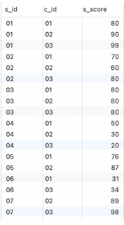
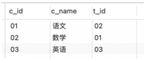

### 1、like 与 rlike
- like的内容不是正则，而是通配符，如： `select * from tablename where col like "%jj%"`
- rlike的内容可以是正则，也可以是包含某个字符
    - 正则：`select * from tablename where col rlike "^.*jj\d+$"`
    - 包含某个字符： `SELECT * FROM categories WHERE  Category  RLIKE "or"`  
        只要Category字段的值中包含 `or` 的行，将会被输出
      
### 2、数据库操作
- `show databases`  查看数据库
- `use database_name`   使用某个数据库
- `show tables` 查看表
- `show columns from table_name` 查看表信息
- `SHOW INDEX FROM 数据表` 索引信息
- `create DATABASE name` 创建数据库
- `drop database 数据库名;` 删除数据库
  
### 3、表操作
- 创建表
     ```text
    CREATE TABLE IF NOT EXISTS runoob_tbl(
       runoob_id INT UNSIGNED AUTO_INCREMENT,
       runoob_title VARCHAR(100) NOT NULL,
       runoob_author VARCHAR(40) NOT NULL,
       submission_date DATE,
       PRIMARY KEY ( runoob_id )
    )ENGINE=InnoDB DEFAULT CHARSET=utf8;
    ```
    ENGINE 设置存储引擎
- `DROP TABLE table_name ;` 删除表
- 插入数据
    ```text
    INSERT INTO table_name ( col1, col2,...colN )
                           VALUES
                           ( value1, value2,...valueN );
    ```
- 查询数据
    ```text
    SELECT column_name,column_name
    FROM table_name
    [WHERE Clause]
    [LIMIT N][ OFFSET M]
    ```
    你可以使用 WHERE 语句来包含任何条件。  
    你可以使用 LIMIT 属性来设定返回的记录数。  
    你可以通过OFFSET指定SELECT语句开始查询的数据偏移量。默认情况下偏移量为0。
- 更新数据
    - `UPDATE table_name SET field1=new-value1, field2=new-value2 [WHERE Clause]`
- 删除数据
    - `DELETE FROM table_name [WHERE Clause]`
- 查看表结构
    - `desc table_name`
- 查询数量
    - `select count(*) from table_name`
- 截取 point_time 字段的子串，并命名为 new_name, 并按 new_name 降序排列（默认为升序asc）
    - `select distinct substr(point_time,1,10) new_name from one_table order by new_name desc;`
- 为表添加分区（时间分区，2020-07-07的数据存在这个分区内，对于大数据量，提高效率）
    - `alter table 表名 add range partition '2020-07-07' <= values < '2020-07-07\000'`
- 清空表中的数据（使用truncate）
    - truncate删除后不记录mysql日志，因此不可以rollback，更不可以恢复数据
    - `truncate table table_name;`
- 表数据去重
	- `insert overwrite table table_name select distinct * from table_name;`
- 覆盖表中的数据
    - `insert overwrite table table_name ...`
- 去重查询  

	（ 字段1,字段2: 去掉字段1 and 字段2 重复的数据；
	（ * 是所有字段均重复。  
	`select distinct 字段1, 字段2 from table_name`
  
- 删除列
	
	法1：  
	`alter table table_name drop column column_name`

	法2：(括号里是要保留的列及其类型)  
	`alter table table_name REPLACE columns(column_name1 STRING, columns_name2 INT);` 
  
- 截取某个字段的字符串某几位
	- 截取某列中1到5位置的字符串
	- `select substring(列名,1,5) from 表名;`
    
- 清空表
	```
	# truncate不能回滚,但是快
	truncate table 表名;
	```  
	```
	# delete可以回滚，但是慢（一条一条的删除）
	delete from 表名;
	```

- 添加字段
	- `alter table 表名 add columns(列名1 int, 列名2 string);`

- 其他：排序、分组、like
- `quit` 退出数据库连接

### 重点：sql查询语句
- 1、  

```text
select * from (select distinct dwd.orig_url from dwd.dwd_feeds_crawl_content_i_d dwd
where dwd.ds = 20220214 
and dwd.orig_domain ='comicbook.com'
and dwd.res_type = '1'
and dwd.valid_status = '100'
group by dwd.orig_url) a  full outer join (select distinct dwd.orig_url from dwd.dwd_feeds_crawl_content_i_d dwd
where dwd.ds = 20220214
and dwd.res_type = '1'
and dwd.source_host_name = 'comicbook.com'
group by dwd.orig_url
) b
on 
replace(a.orig_url, '.amp?', '') =b.orig_url
```

- 2、case when 与 group by 的结合
    - 成绩Score表：  
      
    - 课程Course表：  
    
      
    - Case when 与 group by的结合使用，一般根据主干进行分组
    - 例如1：查看每个学生的及格的课程数
    - 分析：主干是每个学生，则根据每个学生id进行分组；那么case when语句就是统计每个分组内满足条件的，如下：
        ```text
        SELECT 
            s_id,  
            SUM(CASE WHEN s_score >= 60 THEN 1 ELSE 0 END) AS MALE_PASS
        FROM 
            score
        GROUP BY s_id
        ```
      
    - 例如2：
        查询各科成绩最高分、最低分和平均分：以如下形式显示：课程ID，课程name，最高分，最低分，平均分，及格率，中等率，优良率，优秀率 （及格为>=60，中等为：70-80，优良为：80-90，优秀为：>=90）
    - 分析：因为要求显示 课程ID，课程name，此为主干，则按照课程ID，课程name进行分组，那么case when语句就是统计每个分组内满足条件的，如下：
        ```text
        select 
            a.c_id,
            b.c_name,
            MAX(s_score),
            MIN(s_score),
            ROUND(AVG(s_score),2),
            ROUND(100*(SUM(case when a.s_score>=60 then 1 else 0 end)/SUM(case when a.s_score then 1 else 0 end)),2) as 及格率,
            ROUND(100*(SUM(case when a.s_score>=70 and a.s_score<=80 then 1 else 0 end)/SUM(case when a.s_score then 1 else 0 end)),2) as 中等率,
            ROUND(100*(SUM(case when a.s_score>=80 and a.s_score<=90 then 1 else 0 end)/SUM(case when a.s_score then 1 else 0 end)),2) as 优良率,
            ROUND(100*(SUM(case when a.s_score>=90 then 1 else 0 end)/SUM(case when a.s_score then 1 else 0 end)),2) as 优秀率
        from score a 
        left join course b on a.c_id = b.c_id 
        GROUP BY a.c_id,b.c_name
        ```
      
- 3、查询每门功成绩最好的前两名（上面的 成绩Score表 ）
    ```text
    select a.s_id,a.c_id,a.s_score 
    from score a
    where (
        select COUNT(*) 
        from score b 
        where b.c_id=a.c_id and b.s_score>=a.s_score
    )<=2 
    ORDER BY a.c_id, a.s_score DESC
    ```