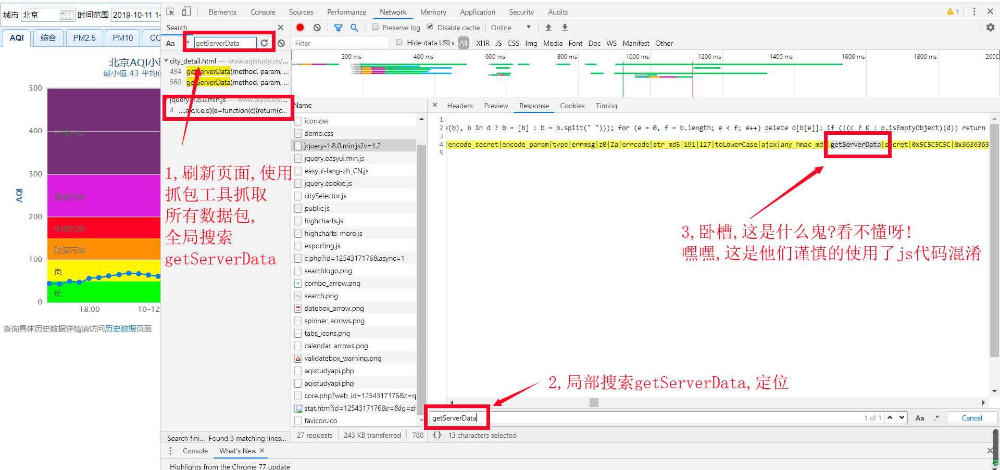

 ## 如何看出是哪种加密？
- Base64加密
    - 一般是 1 个 '=' 结尾 （若是 '==' 结尾，删掉一个？）
        - 例如: bmV0ZHolNDBzaW5hLmNvbQ=

## 1、md5 加密
- md5一旦加密，数据就不能返回成原来的值了，是不可以解密的
```python
import hashlib
## ====================== bv
str1 = 'this is a sentence'

# 1、创建hash对象
hl = hashlib.md5()

# 2、向hash对象中添加需要做hash运算的字符串
hl.update(str1.encode('utf-8'))  # 这个地方传的是bytes类型的数据，否则会报错

# 3、获取字符串的hash值
bv = hl.hexdigest()


### 或者只需要一句代码
str1_md5 = hashlib.md5(str1.encode(encoding='utf-8')).hexdigest()
```

## 2、RSA 加密

## 3、懒加载
- 懒加载：网页懒加载是前端为了提高网页访问速度，将页面内没有出现在可视区域内的图片先不做加载，等到手动滑动鼠标滚动到可视区域后再加载。
        这样对于网页加载性能上会有很大的提升，懒加载的效果就可以提升用户体验。
- 爬取思路： 
        网页中包含大量的图片，如果一次性全部加载，页面会因为请求过多造成卡顿，并且对服务器也会造成压力，
        那么程序员可以将图片的src属性设置成伪属性，一般设置为src2，名称可以任意设定，这样网页在加载的时候不会去请求显示图片，
        当用户滚动到该区域时，在通过JS动态修改属性名为src，实现图片加载。  
    这种思路最终设定不是为了反爬，单纯为了优化页面加载速度，但只要影响到我们去爬取内容，那一概打入反爬套路中。
  
## 4、js混淆

- 【参考】https://www.cnblogs.com/zyyhxbs/p/11663522.html
- js混淆: 我们会惊讶的发现getServerData后面跟的是什么鬼啊?不符合js函数定义的写法呀!看不懂呀!其实这里是经过 JavaScript 混淆加密了（将js代码加密）,
  混淆加密之后,代码将变为人不可读的形式,但是功能是完全一致的,这是一种常见的 JavaScript 加密手段.我们想要查看到该方法的原始实现则必须对其进行反混淆.
- js反混淆: 
    - js 混淆之后,其实是有反混淆方法的,最简单的方法便是搜索在线反混淆网站,例如 http://www.bm8.com.cn/jsConfusion/ ,
        将getServerData存在的这行数据粘贴到反混淆网站中。
    - 其他方法：https://blog.csdn.net/qq_42771415/article/details/105046689

## 5、APP混淆
- 请看 '手机APP数据（抓包）.md'